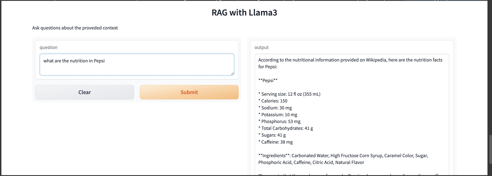

# llama3-RAG-gradio
# Retrieval-Augmented Generation (RAG) System

This project is a Retrieval-Augmented Generation (RAG) system built using Llama 3, LangChain, ChromaDB, and Gradio, all within Google Colab. This setup allows for efficient rapid prototyping and testing of complex AI systems without the need for extensive local hardware resources.

## Technologies Used

### Llama 3
Llama 3 is a state-of-the-art language model known for its exceptional language understanding and generation capabilities. It serves as the backbone of the RAG system, providing the generative power needed to create coherent and contextually appropriate text.

### LangChain
LangChain is a powerful tool designed to streamline the integration of large language models into applications by managing the complexities of chaining together multiple calls and orchestrating workflows. It simplifies the process of building complex, multi-step AI applications, making it easier to implement sophisticated RAG systems.

### ChromaDB
ChromaDB is a high-performance, distributed database optimized for handling the large-scale, real-time data needs of modern applications. In the context of a RAG system, ChromaDB provides the robust and scalable storage solution necessary for managing the vast amounts of data that the retrieval components depend on.

### Gradio
Gradio is an intuitive web-based interface that allows developers to quickly create customizable UIs for machine learning models. In this RAG system, Gradio facilitates easy interaction with the underlying technologies, enabling users to input queries and receive responses in a user-friendly manner.

Google Colab offers a powerful platform for developing and prototyping machine learning applications, providing access to high-performance GPUs that are essential for training and running complex models like Llama 3. Colab’s cloud-based environment eliminates the need for extensive local hardware resources, allowing for seamless collaboration and efficient iteration. By running Gradio directly from Colab notebooks, you can quickly deploy and test interactive AI applications, accelerating the development process and ensuring rapid prototyping and testing.
